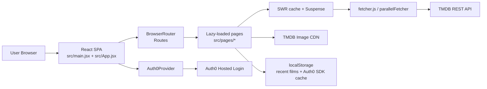
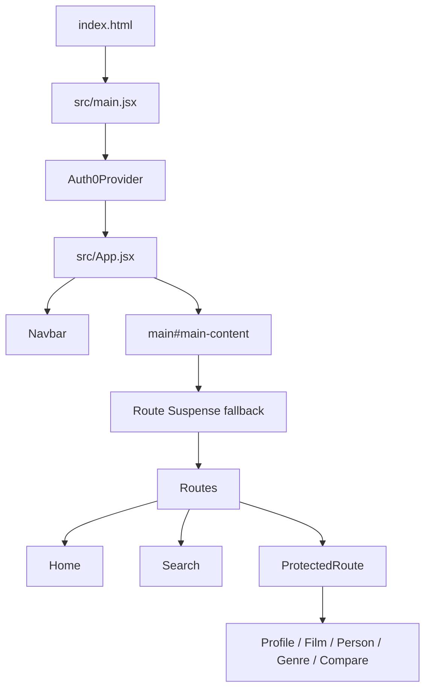
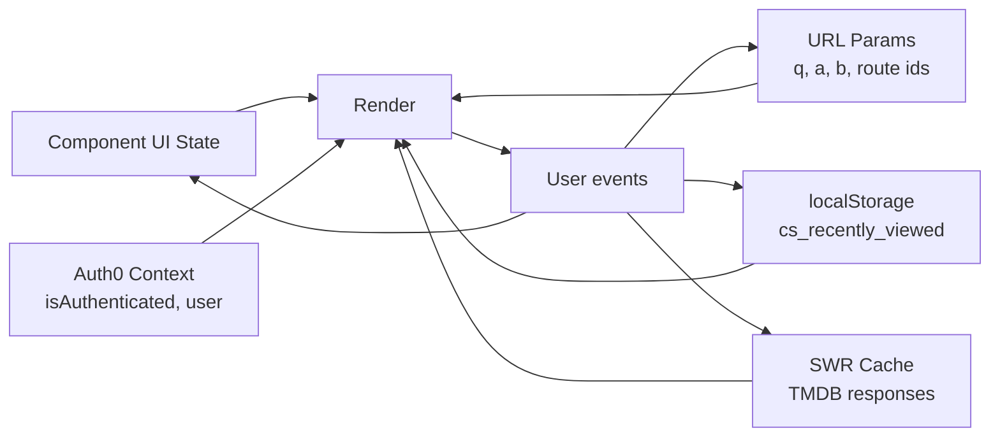
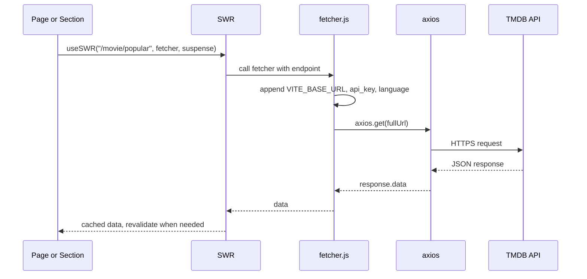
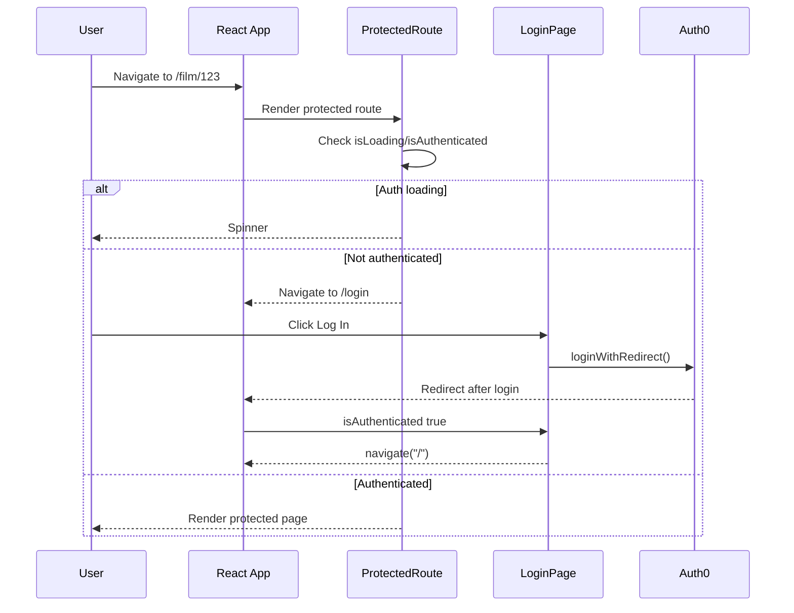

# CinemaScope Project Summary

Generated from direct repository inspection of the CinemaScope codebase in `/Users/akrishnasrikar/Projects/cscope`.

This document is written for new developers, future AI agents, technical reviewers, demo audiences, and long-term architecture planning. It separates confirmed implementation details from assumptions and recommendations.

## Inspection Snapshot

Confirmed:

- The project is a React 18 + Vite 6 single-page application.
- There is no application backend, database layer, server middleware, or persistent datastore in the repository.
- Data comes from TMDB through client-side HTTP requests.
- Authentication is wired through Auth0's React SDK, but full production auth depends on valid tenant credentials and Auth0 dashboard configuration.
- `npm run build` passes.
- `npm run lint` currently fails with 135 ESLint errors, mostly due to missing PropTypes rules, unused imports, `fetchpriority` casing, unescaped entities, and one missing key in an array render.

Assumptions:

- Deployment is intended to be static hosting such as Vercel, Netlify, Cloudflare Pages, or another CDN-backed host, because the app builds to `dist/` and has no server runtime.
- Future product direction is a film discovery and review/community platform, based on current profile placeholders and `docs/improvements.md`.

---

## 1. Project Overview

CinemaScope is a cinematic film discovery web application. It lets users browse popular films, explore curated genre sections, search across movies and people, inspect detailed film and person pages, compare two films side by side, and maintain a small local "recently viewed" history.

The core purpose is to turn a large external media catalog into an immersive, premium browsing experience. The project emphasizes polish, responsive design, loading quality, and cinematic presentation rather than CRUD workflows.

Target audiences:

- Film fans who want visually rich discovery and browsing.
- Hiring reviewers or demo viewers evaluating frontend/product craft.
- Future contributors extending the app into ratings, reviews, watchlists, and community features.
- Investors or stakeholders evaluating whether the current product can evolve beyond a demo.

Main problem solved:

- TMDB already has the data, but raw catalog APIs are not a product experience. CinemaScope wraps TMDB data in a curated, polished, responsive UI with useful browsing paths: popular films, genre rows, search, film detail, cast detail, watch providers, and comparison.

Product vision:

- Short term: a polished discovery layer over TMDB.
- Medium term: authenticated personalization, watchlists, ratings, reviews, and better recommendations.
- Long term: a Letterboxd-like social film platform with premium visual design, differentiated discovery, and possible AI-assisted curation.

---

## 2. Tech Stack

| Category         | Confirmed Technology                | Why It Is Used                                                                              | Notes                                                                                      |
| ---------------- | ----------------------------------- | ------------------------------------------------------------------------------------------- | ------------------------------------------------------------------------------------------ |
| Frontend         | React 18                            | Component-based UI, hooks, Suspense boundaries, React.lazy route splitting                  | All app logic is client-side JSX.                                                          |
| Frontend         | Vite 6                              | Fast local dev server, optimized static production build, simple environment variable model | Configured in `vite.config.js`, dev server port `5173`.                                    |
| Frontend Routing | `react-router-dom` v7               | Browser SPA routing, dynamic route params, URL search params                                | Routes are declared in `src/App.jsx`.                                                      |
| Backend          | None in repo                        | The app is currently a static frontend calling external APIs directly                       | No Express, serverless functions, API routes, or middleware.                               |
| Database         | None in repo                        | No persisted app-owned records yet                                                          | Only `localStorage` for recently viewed films and Auth0 SDK token/session cache.           |
| Authentication   | `@auth0/auth0-react`                | Hosted login, user profile claims, auth state, refresh-token support                        | Configured in `src/main.jsx`; protected routing in `src/components/ui/ProtectedRoute.jsx`. |
| State Management | React `useState`, `useEffect`, refs | Local UI state for search, filters, hero carousel, dropdowns, expanded sections             | No Redux, Zustand, Recoil, or global store.                                                |
| State Management | SWR                                 | Client-side data fetching, cache, revalidation, Suspense integration                        | Used across pages and sections with `suspense: true`.                                      |
| State Management | URL params                          | Shareable search and comparison state                                                       | `SearchPage` uses `q`; `ComparePage` uses `a` and `b`.                                     |
| State Management | `localStorage`                      | Recently viewed films and Auth0 SDK cache                                                   | `useRecentlyViewed` stores last 10 films under `cs_recently_viewed`.                       |
| Styling          | Tailwind CSS v4                     | Utility-first styling with design tokens generated through `@theme`                         | Tokens live in `src/styles/tokens.css`.                                                    |
| Styling          | Global CSS                          | Reset, center container, skeleton shimmer, focus-visible, reduced motion                    | `src/styles/globals.css`.                                                                  |
| Styling/Icons    | MUI components and icons            | Icons, `CircularProgress`, visual controls                                                  | Large icon library import surface contributes to bundle size.                              |
| Animations       | Framer Motion                       | Hero content transitions and premium motion                                                 | Used primarily in `src/components/sections/Hero.jsx`.                                      |
| AI integrations  | None confirmed                      | No OpenAI, local model, vector DB, prompt templates, or generation flows                    | AI opportunities are listed later as future work.                                          |
| Deployment       | Static Vite build                   | The app compiles to static assets in `dist/`                                                | No deployment config committed. SPA rewrites are required on static hosts.                 |
| Tooling          | npm scripts                         | `dev`, `build`, `lint`, `preview`                                                           | Defined in `package.json`.                                                                 |
| Tooling          | ESLint 9 flat config                | Linting React/JSX/hooks/refresh rules                                                       | Current lint config is stricter than the current codebase.                                 |
| Tooling          | Path alias `@/`                     | Cleaner imports from `src/`                                                                 | Configured in `vite.config.js` and `jsconfig.json`.                                        |
| External APIs    | TMDB REST API                       | Movies, people, credits, providers, search, discover, genre data                            | API key is read from `VITE_API_KEY`.                                                       |
| External APIs    | TMDB image CDN                      | Poster, backdrop, and profile images                                                        | Centralized partly in `src/lib/utils/tmdbImage.js`.                                        |
| External APIs    | Auth0                               | Authentication and profile claims                                                           | Needs valid tenant/application configuration.                                              |
| External APIs    | Google Fonts                        | Epilogue, Playfair Display, Inter, DM Mono                                                  | Loaded in `index.html` with `subset=latin`.                                                |
| External APIs    | GitHub URL                          | Footer developer credit                                                                     | Optional `VITE_GITHUB_URL`.                                                                |

---

## 3. Architecture Overview

### Overall Architecture

CinemaScope is a client-rendered SPA. The browser loads `index.html`, Vite's bundled React application mounts at `#root`, Auth0 initializes global auth state, and `BrowserRouter` renders the current route.

Most pages fetch TMDB data directly from the browser using SWR. SWR keys are TMDB endpoint fragments such as `/movie/popular` or `/person/{id}`. `src/lib/api/fetcher.js` turns those fragments into full TMDB URLs by appending `api_key` and `language=en-US`.



### Folder Structure Philosophy

The project uses a separation-of-concerns structure:

- `pages/`: route-level composition. Pages decide which data-driven sections render and where Suspense/ErrorBoundary boundaries live.
- `components/layout/`: application chrome shared by routes, currently `Navbar` and `Footer`.
- `components/sections/`: larger page sections such as `Hero`, `GenreRow`, and `HeroCarousel`.
- `components/ui/`: reusable primitives such as cards, image fallback, skeletons, scroll rows, tabs, and buttons.
- `hooks/`: reusable state or browser behavior.
- `lib/api/`: API helpers.
- `lib/constants/`: static metadata such as genre maps and home section definitions.
- `lib/utils/`: small utility helpers such as TMDB image URL builders.
- `styles/`: global CSS and Tailwind token definitions.

The boundary is mostly clean: page components and section components fetch data; UI primitives generally do not. One exception is `FilmCard`, which is a UI primitive but also performs navigation through `useNavigate`. That is convenient, but it couples the primitive to React Router.

### Rendering Strategy

Rendering is entirely client-side:

- `src/main.jsx` renders `<App />` under `<Auth0Provider>`.
- `src/App.jsx` uses `React.lazy()` for all route pages.
- `<Suspense>` wraps the route set with a page loader.
- Individual pages create more granular Suspense boundaries around data sections.
- Skeletons in `src/components/ui/Skeletons.jsx` reserve dimensions to reduce layout shift.

There is no SSR, SSG, server component architecture, or backend-rendered HTML.



### State Flow

State is intentionally lightweight:

- Local UI state lives in components through `useState`.
- Async server data lives in SWR's in-memory cache.
- Browser URL state handles query and compare params.
- Auth state comes from Auth0 SDK context.
- Recently viewed films live in `localStorage`.

There is no normalized domain store. That is fine for the current app because data is mostly read-only and page-scoped.



### Authentication Flow

Confirmed implementation:

1. `Auth0Provider` is configured in `src/main.jsx`.
2. Public routes are `/`, `/login`, `/search`, and `/search/:query`.
3. Protected routes are `/profile`, `/film/:id`, `/person/:person_id`, `/genre/:id`, and `/compare`.
4. `ProtectedRoute` reads `isAuthenticated` and `isLoading` from `useAuth0()`.
5. While loading, it displays a spinner.
6. If unauthenticated, it redirects to `/login`.
7. `LoginPage` calls `loginWithRedirect()` when the user clicks the login button.
8. If authenticated, `LoginPage` navigates back to `/`.

Important nuance:

- `ProtectedRoute` imports `loginWithRedirect` but does not use it.
- `ProtectedRoute` does not currently preserve the originally requested route. It redirects to `/login`, and after login the user is sent to `/` by `LoginPage`.
- Auth0 refresh tokens are enabled and cache location is `localstorage`.

### API Communication Flow

Most active data fetching uses:

- `useSWR(endpoint, fetcher, { suspense: true })`
- `fetcher()` in `src/lib/api/fetcher.js`
- Axios `get()`
- TMDB response data returned directly to components



### Data Lifecycle

1. Route loads.
2. Lazy page chunk is fetched.
3. Page renders a Suspense boundary.
4. Data-driven child calls SWR.
5. SWR checks memory cache.
6. If missing/stale, SWR calls `fetcher`.
7. Component suspends until data resolves.
8. Skeleton renders during suspension.
9. Resolved data renders UI.
10. Runtime errors are caught by `ErrorBoundary` where configured.
11. Some actions update URL params or `localStorage`.

There is no server-side cache, persisted SWR cache, database write, queue, or background sync.

---

## 4. Folder & File Breakdown

### Root Files

`package.json`

- Defines the app as private ESM package `cinemascope`.
- Scripts: `dev`, `build`, `lint`, `preview`.
- Dependencies confirm the app is frontend-only: React, Vite, Tailwind, Auth0, SWR, Axios, Framer Motion, MUI, React Router.

`vite.config.js`

- Enables React and Tailwind v4 through `@tailwindcss/vite`.
- Defines `@` alias to `src`.
- Sets dev server port to `5173`.

`jsconfig.json`

- Mirrors the Vite alias for editor IntelliSense.

`eslint.config.js`

- Uses ESLint flat config with recommended JS, React, React JSX runtime, hooks, and React Refresh rules.
- Ignores `dist`.
- Currently enforces PropTypes, which the codebase does not use. This is the main reason lint fails.

`index.html`

- Loads Google Fonts with preconnect and `subset=latin`.
- Defines a keyboard skip link to `#main-content`.
- Mounts the React app at `#root`.
- Uses `/vite.ico` as favicon even though `public/favicon.jpeg` also exists.

`.env.example`

- Documents TMDB, Auth0, and GitHub URL variables.
- Includes commented sample Auth0 tenant/client values. These are not server secrets, but they should still be reviewed before public distribution.

`.gitignore`

- Ignores `.env`, logs, `node_modules`, `dist`, editor artifacts, and system files.

`dist/`

- Build output exists locally and is ignored by git.
- Latest inspected build created route chunks and a 311 kB vendor/index JS chunk before gzip.

### `src/main.jsx`

Responsibilities:

- Creates the React root.
- Wraps the app in `React.StrictMode`.
- Configures Auth0Provider with:
  - `VITE_AUTH0_DOMAIN`
  - `VITE_AUTH0_CLIENT_ID`
  - `VITE_AUTH0_AUDIENCE`
  - `scope: "openid profile email"`
  - `cacheLocation="localstorage"`
  - `useRefreshTokens={true}`
- Imports global styles.

Architectural importance:

- This is the only global provider currently configured.
- There is no global SWRConfig provider, theme provider, analytics provider, or error tracking provider.

### `src/App.jsx`

Responsibilities:

- Defines route-level code splitting with `React.lazy()`.
- Wraps route rendering with Suspense.
- Renders the global `Navbar`.
- Provides `main#main-content` target for skip navigation.
- Defines public and protected routes.

Routes:

| Route                | Component     | Protection |
| -------------------- | ------------- | ---------- |
| `/`                  | `Home`        | Public     |
| `/login`             | `LoginPage`   | Public     |
| `/search`            | `SearchPage`  | Public     |
| `/search/:query`     | `SearchPage`  | Public     |
| `/profile`           | `Profile`     | Protected  |
| `/film/:id`          | `FilmPage`    | Protected  |
| `/person/:person_id` | `Person`      | Protected  |
| `/genre/:id`         | `GenrePage`   | Protected  |
| `/compare`           | `ComparePage` | Protected  |

### `src/pages/`

`Home.jsx`

- Fetches popular films for the hero with SWR.
- Renders recently viewed films from `localStorage`.
- Renders genre rows from `GENRE_SECTIONS`.
- Uses `HomeHeroSkeleton`, `ErrorBoundary`, `GenreRow`, `FilmCard`, `ScrollRow`, and `Footer`.

`FilmPage.jsx`

- Main film detail route.
- Fetches movie details and release dates in parallel.
- Fetches credits, watch providers, and similar movies in independent boundaries.
- Records visited films with `useRecentlyViewed`.
- Implements cast grid lazy activation with `IntersectionObserver`.

`Person.jsx`

- Fetches person details and movie credits.
- Renders biography with read more/read less behavior.
- Renders known-for filmography as a horizontal scroll row.
- Dedupe filmography by film id and sorts by popularity.

`SearchPage.jsx`

- Supports route param query and URL `q` param.
- Debounces input by 500 ms.
- Calls TMDB `/search/multi`.
- Splits results into movies and people.
- Renders empty/no-result states.

`GenrePage.jsx`

- Full genre browsing page.
- Reads genre id from route.
- Supports sort tabs and filter tabs.
- Fetches first page through SWR and fetches more pages imperatively.
- Uses poster URLs from the results to create a blurred hero mosaic.

`ComparePage.jsx`

- Side-by-side film comparison tool.
- Stores selected film ids in URL params `a` and `b`.
- Contains inline debounced film search.
- Fetches individual film details through SWR.
- Supports clear and swap actions.

`LoginPage.jsx`

- Shows a branded login screen.
- Calls `loginWithRedirect()` only after user clicks "Log In".
- Navigates authenticated users to `/`.

`Profile.jsx`

- Reads Auth0 `user`, `isAuthenticated`, and `logout`.
- Displays profile metadata from Auth0 claims.
- Has commented-out placeholders for future watch history/review/favorite stats.

### `src/components/layout/`

`Navbar.jsx`

- Fixed/absolute translucent navigation bar.
- Measures actual navbar height and writes `--navbar-height` to `document.documentElement`.
- Includes expanding search capsule.
- Includes centered wordmark.
- Includes Compare link on larger screens.
- Shows Auth0 avatar when authenticated, otherwise a person icon.

`Footer.jsx`

- Displays copyright and GitHub credit.
- Uses optional `VITE_GITHUB_URL`.
- Mentions TMDB API.

### `src/components/sections/`

`Hero.jsx`

- Main cinematic hero carousel.
- Receives films as props.
- Uses three-layer backdrop transition:
  - Layer A: current image.
  - Layer B: incoming image.
  - Layer C: permanent vignette/grain overlay.
- Preloads incoming backdrops with `new Image()`.
- Auto-advances every 5 seconds.
- Pauses auto-advance after manual navigation.
- Uses Framer Motion for metadata/title transitions.
- Respects `prefers-reduced-motion` via `useReducedMotion`.
- Supports arrow key navigation on the section.

`HeroCarousel.jsx`

- Desktop-only "Now Showing" poster strip.
- Syncs active card into the center of the scroll container.
- Supports keyboard scrolling and clickable poster cards.
- Imports `ScrollRow` but does not use it, which lint flags.

`GenreRow.jsx`

- Home-page genre section with a heading, tabs, and four visible films.
- Fetches based on active tab:
  - `FEATURED`: `/discover/movie?sort_by=popularity.desc&with_genres=...`
  - `IN THEATERS`: `/movie/now_playing?...`
  - `TOP RATED`: `/movie/top_rated?...`
- Renders `FilmCard` grid and `BrowseMoreLink`.

`StatsBlock.jsx`

- A cinematic stats/heading/poster bleed section.
- Currently not rendered from `Home.jsx`.
- Uses hardcoded stats and direct TMDB image URL construction.

`PopularMoviesSection.jsx`

- Older horizontal popular movies section.
- Currently not referenced by active routes.
- Uses older Tailwind sizing conventions and direct TMDB image URLs.

### `src/components/ui/`

`FilmCard.jsx`

- Reusable poster card with LazyImage, hover scale, title, optional subtitle.
- Navigates to `/film/{id}` on click, Enter, or Space.
- Includes `role="button"`, `tabIndex`, and focus ring.

`LazyImage.jsx`

- Image wrapper with skeleton shimmer until loaded.
- Handles image errors with icon fallback.
- Defaults to `loading="lazy"`.
- Supports `eager` and `fetchpriority`, though React expects `fetchPriority` casing.

`ScrollRow.jsx`

- Generic horizontal scroll primitive.
- Provides optional arrows and keyboard ArrowLeft/ArrowRight scrolling.
- Used by recently viewed and person filmography.

`Skeletons.jsx`

- Contains tailored skeleton components for hero, film detail, cast, genre row, film row, similar movies, person header, and film grid.
- Skeletons are deliberately dimension-matched to final content.

`ErrorBoundary.jsx`

- Class component catching render errors below it.
- Displays a generic "Failed to load section" fallback.
- Supports optional custom fallback and retry handler.
- Logs to console but does not report to Sentry or another telemetry service.

`ProtectedRoute.jsx`

- Client-side auth guard.
- Shows spinner while Auth0 is initializing.
- Redirects unauthenticated users to `/login`.

`BackButton.jsx`

- Fixed-position back button.
- Uses `useBackNavigation` to decide between browser back and fallback route.
- Offset depends on `--navbar-height`.

`FilterTabs.jsx`

- Home genre tabs: `FEATURED`, `IN THEATERS`, `TOP RATED`.

`BrowseMoreLink.jsx`

- Text CTA used by genre rows.

`PaginationDots.jsx`

- Vertical dot control component.
- Not currently referenced by active pages.

`PlayButton.jsx`

- Trailer/play CTA primitive.
- Not currently wired to any route or video endpoint.

### `src/hooks/`

`useBackNavigation.js`

- Uses `window.history.length` to choose `navigate(-1)` or fallback route.

`useRecentlyViewed.js`

- Reads/writes recent films to `localStorage`.
- Stores max 10 films.
- Dedupe by film id.
- Syncs across tabs through the `storage` event.
- Handles unavailable/quota-failing localStorage with try/catch.

`useReducedMotion.js`

- Watches `(prefers-reduced-motion: reduce)` and returns a reactive boolean.

`useMoviesByGenre.js`

- Legacy hook using browser `fetch` directly rather than SWR.
- Not referenced by current active code.
- Could be removed or migrated if no future usage exists.

### `src/lib/`

`api/fetcher.js`

- Primary API abstraction.
- Uses Axios.
- Appends `api_key` and `language=en-US`.
- Supports full URLs or relative TMDB endpoints.
- Exports `parallelFetcher`.

`api/tmdb.js`

- Legacy manual API functions.
- Not referenced by current active pages.
- Contains old endpoint names such as `/movie/toprated` and `/movie/nowplaying` that do not match TMDB's standard `/movie/top_rated` and `/movie/now_playing` paths.

`utils/tmdbImage.js`

- Centralized TMDB image URL construction.
- Returns null when a path is absent.
- Notes that TMDB CDN can auto-serve WebP based on the Accept header.

`constants/index.js`

- Defines `GENRE_MAP`, `GENRE_SECTIONS`, and `logoURL`.
- `GENRE_SECTIONS` drives the homepage genre rows.

### `src/styles/`

`tokens.css`

- Tailwind v4 `@theme` block defining colors, fonts, font sizes, shadows, blur, radii, durations, and easings.
- Explicitly states that gold should be reserved for ratings, CTAs, and active states.

`globals.css`

- Imports Tailwind and tokens.
- Defines page reset, body background, `.center-container`, skeleton shimmer, spin animation, typography tweaks, focus-visible styles, active button scale, and global reduced-motion behavior.

### `public/`

Contains fallback and brand assets:

- `fallback-image-film.jpg`
- `fallback-image.jpg`
- `favicon.jpeg`
- `logo1.png`
- `vite.ico`

Several files have mismatched extensions versus actual file type according to `file`; for example some `.jpg` assets are PNG data. Browsers usually handle this, but it is worth normalizing for CDN caching and content-type correctness.

### `docs/`

Existing documentation:

- `docs/improvements.md`: candid future backlog.
- `docs/auth.md`: Auth0 explanation, partly stale because it describes original-route preservation that current `ProtectedRoute` does not implement.
- `docs/main.md`: architecture notes about SWR, filters, search, hooks, and hero transitions.
- `docs/loom-walkthrough.md` and `docs/script.md`: demo scripts.

---

## 5. Core Features

### Cinematic Home Hero

What it does:

- Shows a full-viewport hero based on TMDB popular movies.
- Auto-rotates featured films.
- Displays title, genre tags, year, and rating.
- Shows a desktop poster strip for related popular films.

How it works internally:

- `Home.jsx` fetches `/movie/popular` with SWR.
- First result becomes `featuredFilm`.
- Next results become `relatedFilms`.
- `Hero.jsx` owns animation state and receives data as props.
- `Hero.jsx` preloads incoming backdrops before crossfading.

Related files:

- `src/pages/Home.jsx`
- `src/components/sections/Hero.jsx`
- `src/components/sections/HeroCarousel.jsx`
- `src/hooks/useReducedMotion.js`
- `src/lib/utils/tmdbImage.js`

API interactions:

- `GET /movie/popular`
- TMDB image CDN for backdrops and posters.

Edge cases handled:

- If there are no films, `Hero` returns null.
- If backdrop path is missing, no backdrop image is rendered.
- Reduced-motion users receive static/instant variants.
- Manual navigation pauses auto-advance temporarily.

Scalability considerations:

- The hero currently depends on the popular endpoint only. A backend or remote config could rotate editorial picks, sponsored films, region-specific trends, or curated lists.
- The hero uses timers and refs carefully, but future data changes while the component is mounted should be tested because some effect dependencies are intentionally suppressed.

### Genre Rows on Home

What it does:

- Renders curated homepage sections: Drama & Romance, Action & Adventure, and Comedy.
- Each row has tabs for Featured, In Theaters, and Top Rated.
- Each row fetches and renders independently.

How it works internally:

- `GENRE_SECTIONS` defines section metadata.
- `Home.jsx` maps over `GENRE_SECTIONS`.
- `GenreRow.jsx` owns active tab state.
- `GenreRowContent` builds a TMDB endpoint from tab and genre ids.
- Each row uses its own SWR request and Suspense fallback.

Related files:

- `src/pages/Home.jsx`
- `src/components/sections/GenreRow.jsx`
- `src/components/ui/FilterTabs.jsx`
- `src/components/ui/BrowseMoreLink.jsx`
- `src/lib/constants/index.js`

API interactions:

- `GET /discover/movie?sort_by=popularity.desc&with_genres=...`
- `GET /movie/now_playing?...`
- `GET /movie/top_rated?...`

Edge cases handled:

- ErrorBoundary prevents a failed row from crashing the whole page.
- Skeletons match the four-card grid.

Important technical caveat:

- TMDB list endpoints such as `/movie/now_playing` and `/movie/top_rated` do not behave like `/discover/movie`. Querying them with `with_genres` may not filter results as intended. For reliable genre filtering, use `/discover/movie` with date filters, vote filters, and sort parameters.

Scalability considerations:

- The current model is easy to extend by editing `GENRE_SECTIONS`.
- For many rows, the app may hit TMDB rate limits because each row fetches independently.
- A backend cache or request coalescing layer would help as the homepage becomes richer.

### Recently Viewed Films

What it does:

- Shows the user's last viewed films on the homepage.
- Allows clearing the local history.

How it works internally:

- `FilmPage` calls `addFilm(film)` on mount after film data resolves.
- `useRecentlyViewed` stores `{ id, title, poster_path }` objects in `localStorage`.
- The hook caps entries at 10 and dedupes existing films.
- A `storage` listener syncs changes across browser tabs.

Related files:

- `src/hooks/useRecentlyViewed.js`
- `src/pages/FilmPage.jsx`
- `src/pages/Home.jsx`
- `src/components/ui/ScrollRow.jsx`
- `src/components/ui/FilmCard.jsx`

API/database interactions:

- No server or database.
- Uses browser `localStorage` only.

Edge cases handled:

- Invalid JSON or unavailable localStorage returns an empty list.
- localStorage write errors are swallowed safely.
- Duplicate film visits move that film to the front.

Scalability considerations:

- Local history is device-specific and anonymous.
- Once a backend exists, this should become authenticated watch history with server sync and privacy controls.

### Search

What it does:

- Lets users search movies, actors, and directors.
- Supports direct URL state via `q`.
- Displays movies and people in separate sections.

How it works internally:

- Navbar search navigates to `/search?q=...`.
- `SearchPage` reads route param or query param.
- Controlled input uses `inputValue`; API-driving state uses `searchTerm`.
- Input changes are debounced for 500 ms.
- `SearchResults` calls `/search/multi` with SWR.
- Results are filtered by `media_type`.

Related files:

- `src/components/layout/Navbar.jsx`
- `src/pages/SearchPage.jsx`
- `src/components/ui/LazyImage.jsx`
- `src/components/ui/Skeletons.jsx`

API interactions:

- `GET /search/multi?query={term}&page=1`

Edge cases handled:

- Empty search shows a neutral prompt.
- No results shows a no-results state.
- Clear button resets state and focuses the input.
- Enter bypasses debounce.

Scalability considerations:

- Search only fetches page 1.
- Debounce timers are not explicitly cleaned up on unmount.
- No cancellation with AbortController.
- A future backend could support search analytics, ranking, typo tolerance, and saved searches.

### Film Detail Page

What it does:

- Displays rich film details, hero backdrop, poster, certification, metadata, overview, cast, watch providers, and similar movies.

How it works internally:

- `FilmHero` uses `parallelFetcher` to fetch `/movie/{id}` and `/movie/{id}/release_dates` together.
- `CastSection`, `WatchProviders`, and `SimilarMovies` each fetch in independent Suspense boundaries.
- `CastSection` delays rendering profile images until the section intersects the viewport.
- `FilmHero` records the movie in recently viewed localStorage.

Related files:

- `src/pages/FilmPage.jsx`
- `src/lib/api/fetcher.js`
- `src/hooks/useRecentlyViewed.js`
- `src/components/ui/LazyImage.jsx`
- `src/components/ui/Skeletons.jsx`
- `src/components/ui/FilmCard.jsx`

API interactions:

- `GET /movie/{id}`
- `GET /movie/{id}/release_dates`
- `GET /movie/{id}/credits`
- `GET /movie/{id}/watch/providers`
- `GET /movie/{id}/similar`

Edge cases handled:

- Certification defaults to `N/A`.
- Release, runtime, and genres default to `N/A` when absent.
- Missing posters use `/fallback-image-film.jpg`.
- Empty cast, provider, or similar sections return null.
- Separate ErrorBoundaries isolate failures by section.

Scalability considerations:

- This is the natural home for future reviews, ratings, trailers, list actions, comments, and personalized recommendations.
- Many independent requests can make the page chatty. A backend aggregation endpoint could return film details, release data, credits, providers, and similar movies in one cacheable response.

### Watch Providers

What it does:

- Shows where a film can be streamed, rented, or bought.
- Uses US region when available, otherwise first available region.

How it works internally:

- `WatchProviders` fetches `/movie/{id}/watch/providers`.
- It reads `results.US` or falls back to `Object.values(results)[0]`.
- It renders `flatrate`, `rent`, and `buy` provider groups.

Related files:

- `src/pages/FilmPage.jsx`

API interactions:

- `GET /movie/{id}/watch/providers`
- Provider logo images from TMDB image CDN.

Edge cases handled:

- Missing region data returns null.
- Empty provider groups return null.

Scalability considerations:

- Region should become a user preference.
- Provider availability changes frequently, so a backend cache would need a short TTL.

### Person Page

What it does:

- Displays actor/person profile, biography, birth/death data, and known-for films.

How it works internally:

- `PersonHeader` fetches `/person/{person_id}`.
- `FilmographyRow` fetches `/person/{person_id}/movie_credits`.
- Filmography is sorted by popularity, deduped by film id, and limited to 20 items.
- Long bios are truncated at 400 characters with Read More/Read Less.

Related files:

- `src/pages/Person.jsx`
- `src/components/ui/ScrollRow.jsx`
- `src/components/ui/LazyImage.jsx`

API interactions:

- `GET /person/{person_id}`
- `GET /person/{person_id}/movie_credits`

Edge cases handled:

- Missing biography simply omits the bio block.
- Missing dates are not rendered.
- Missing filmography returns null.
- Missing profile/poster images use fallback UI.

Scalability considerations:

- Future versions could separate acting, directing, writing, crew credits, awards, social links, and related people.

### Genre Browse Page

What it does:

- Provides a full grid browsing experience for a single genre.
- Supports sort options and category filters.
- Supports "Load More".

How it works internally:

- Route param `id` maps through `GENRE_MAP`.
- `GenreGrid` builds a URL from genre, sort, filter, and page.
- Page 1 uses SWR.
- Additional pages are loaded with direct `fetcher()` calls and appended to `extraFilms`.
- Filter changes reset page and appended films.
- Hero poster mosaic is built from page 1 result poster paths.

Related files:

- `src/pages/GenrePage.jsx`
- `src/components/ui/FilmCard.jsx`
- `src/lib/constants/index.js`

API interactions:

- `GET /discover/movie`
- `GET /movie/now_playing`
- `GET /movie/top_rated`
- `GET /movie/upcoming`

Edge cases handled:

- Empty results render "No films found for this combination."
- Loading more shows a spinner and disables duplicate action through state.

Scalability considerations:

- Appending pages in component state is fine at small scale but may grow memory use for long sessions.
- TMDB has page limits and rate limits; pagination needs stricter bounds and error UI.
- Filtering genre through list endpoints should be replaced with discover-based queries for correctness.

### Film Comparison

What it does:

- Allows users to compare two films side by side.
- Comparison URL is shareable through `?a={id}&b={id}`.

How it works internally:

- `ComparePage` reads and writes URLSearchParams.
- Empty slots render inline search inputs.
- Inline search debounces for 350 ms and calls `/search/movie`.
- Filled slots render `FilmColumn`, which fetches `/movie/{id}` through SWR.
- Users can clear each slot or swap both slots.

Related files:

- `src/pages/ComparePage.jsx`
- `src/components/ui/LazyImage.jsx`
- `src/lib/utils/tmdbImage.js`

API interactions:

- `GET /search/movie?query={q}&page=1`
- `GET /movie/{id}`

Edge cases handled:

- Empty slots are first-class UI states.
- Search failures collapse results silently.
- Missing metadata renders em dash equivalents in the UI.

Scalability considerations:

- Future compare dimensions: cast overlap, directors, budget, revenue, providers, runtime deltas, ratings distribution, awards, user review sentiment.
- Current search debounce lacks unmount cleanup and request cancellation.

### Authentication, Login, and Profile

What it does:

- Provides a login page and profile page backed by Auth0 user claims.
- Protects data-heavy routes client-side.

How it works internally:

- Auth0Provider initializes auth state.
- `ProtectedRoute` gates protected routes.
- `LoginPage` calls `loginWithRedirect`.
- `Profile` displays `user.picture`, `user.name`, `user.email`, `user.email_verified`, and approximate member-since year from `user.updated_at`.
- `Profile` calls `logout({ returnTo: ... })`.

Related files:

- `src/main.jsx`
- `src/App.jsx`
- `src/components/ui/ProtectedRoute.jsx`
- `src/pages/LoginPage.jsx`
- `src/pages/Profile.jsx`
- `src/components/layout/Navbar.jsx`

External services:

- Auth0.

Edge cases handled:

- Loading auth state shows a spinner.
- Unauthenticated profile direct render has a fallback sign-in prompt, though route protection should normally intercept first.

Scalability considerations:

- A real product needs server-side user records keyed by Auth0 `sub`.
- Client-only route protection is UI gating, not backend authorization.
- Original destination preservation should be implemented.

---

## 6. UI/UX System

### Design System

The design system is token-first:

- Colors, fonts, shadows, radii, durations, and easing live in `src/styles/tokens.css`.
- Tailwind v4 `@theme` turns tokens into utility classes.
- Global CSS supplies resets, `.center-container`, shimmer, focus states, and motion preferences.

Primary visual language:

- Cinematic dark surfaces.
- Large backdrop imagery.
- Gold accent for ratings, CTAs, and active states.
- Serif display typography for cinematic headings.
- Mono metadata labels.
- Smooth fades, poster hover scale, and subtle glass effects.

Core tokens:

- `--color-base`: page root background.
- `--color-surface`: cards and inputs.
- `--color-section-dark`, `--color-section-mid`, `--color-section-light`: genre bands.
- `--color-gold`: rating/CTA/active accent.
- `--font-display`: Playfair Display.
- `--font-wordmark`: Epilogue.
- `--font-body`: Inter.
- `--font-mono`: DM Mono.

### Component Architecture

Reusable UI primitives:

- `FilmCard`: poster card and film navigation.
- `LazyImage`: skeleton and fallback image wrapper.
- `ScrollRow`: keyboard-accessible horizontal scrolling.
- `Skeletons`: page/section-specific loading placeholders.
- `BackButton`: route-aware fixed back control.
- `ErrorBoundary`: local render failure containment.
- `FilterTabs`, `BrowseMoreLink`, `PlayButton`, `PaginationDots`.

Composed sections:

- `Hero`
- `HeroCarousel`
- `GenreRow`
- Legacy/currently unused `StatsBlock` and `PopularMoviesSection`.

Page components orchestrate data and boundaries.

### Responsiveness Strategy

The project relies heavily on CSS `clamp()` rather than many explicit breakpoints:

- Font sizes use clamp for fluid scaling.
- Hero heights and card widths use clamp.
- Container padding uses clamp.
- Grid columns use Tailwind responsive classes and CSS grid minmax/clamp combinations.

This produces fluid mobile-to-desktop behavior with fewer breakpoint jumps.

### Animations and Motion

Motion systems:

- Framer Motion in `Hero.jsx` for content transitions.
- CSS transitions for hover states, poster scale, opacity fades, search expansion, and scroll controls.
- CSS keyframes for shimmer, spinner, and login grid background.
- JS timers for hero auto-advance.

Accessibility consideration:

- `useReducedMotion` swaps hero motion variants.
- Global CSS disables transitions and animations under `prefers-reduced-motion: reduce`.

### Accessibility Considerations

Implemented:

- Skip nav link in `index.html`.
- `main#main-content` in `App.jsx`.
- Focus-visible outlines for buttons and links.
- Keyboard activation for `FilmCard`.
- Arrow-key scrolling for scroll rows.
- Carousel region labeling.
- Error boundaries for graceful failure.
- Skeletons reduce layout shift.
- Lazy images include alt text where available.

Gaps:

- Some clickable elements are `div role="button"` rather than native `button` or link.
- Some icon-only controls need a full audit.
- ESLint does not include `eslint-plugin-jsx-a11y`.
- Some small metadata text may need contrast and minimum-size review.
- Trailer modal is not implemented, so focus trapping is not yet relevant.
- `fetchpriority` should be `fetchPriority` in JSX to avoid React warnings/lint errors.

### Theming System

There is one theme: cinematic dark with a light genre band option.

The theme is not runtime-switchable. Light/dark modes, user themes, and design-token persistence do not exist yet.

### Typography and Layout Patterns

Patterns:

- `font-display` for page/section titles.
- `font-body` for paragraphs, labels, and buttons.
- `font-mono` for metadata, rating labels, and uppercase microcopy.
- `.center-container` for consistent max-width and gutters.
- Poster cards use `aspect-[2/3]`.
- Portrait/cast images use `aspect-[3/4]` or `aspect-[2/3]`.

Technical note:

- Global heading styles apply `letter-spacing: -0.02em`. This gives a cinematic look but should be reviewed against the project convention that discourages negative letter spacing in UI work.

---

## 7. Authentication & Security

### Auth Flow

Confirmed flow:



### Token Handling

Auth0 configuration in `src/main.jsx`:

- `cacheLocation="localstorage"`
- `useRefreshTokens={true}`
- `scope="openid profile email"`
- `audience=import.meta.env.VITE_AUTH0_AUDIENCE`

Implications:

- Sessions survive reloads because Auth0 SDK stores tokens/session metadata in localStorage.
- Refresh tokens can support silent renewal.
- Tokens are accessible to JavaScript, so XSS would be high impact.

### Refresh Logic

Refresh behavior is delegated entirely to Auth0's React SDK. The application does not manually call `getAccessTokenSilently()`, implement interceptors, or attach tokens to API calls because there is no app backend.

### Protected Routes

Protected route list:

- `/profile`
- `/film/:id`
- `/person/:person_id`
- `/genre/:id`
- `/compare`

Public route list:

- `/`
- `/login`
- `/search`
- `/search/:query`

Security caveat:

- Client-side protected routes only control UI access. They do not secure server data. TMDB calls are still client-side and the TMDB API key is exposed as part of a Vite frontend build.

### Middleware Behavior

No middleware exists in the repo.

There are no:

- Server middleware.
- Auth callbacks implemented on a backend.
- API route guards.
- Token validation middleware.
- Rate-limiting middleware.
- Proxy endpoints.

### Vulnerabilities and Improvements

Current risks:

- Auth tokens are stored in localStorage. This increases XSS risk compared with memory or httpOnly secure cookies.
- No Content Security Policy is defined in `index.html`.
- No backend authorization exists.
- `ProtectedRoute` does not preserve the original target route.
- `.env.example` includes commented real-looking Auth0 tenant/client identifiers that should be sanitized for public release.
- TMDB API key is embedded client-side. This is common for pure frontend demos but exposes quota and abuse risk.
- No environment validation catches missing `VITE_API_KEY`, `VITE_BASE_URL`, or Auth0 variables at startup.
- No Sentry or production error reporting.
- No dependency vulnerability gate in CI.

Recommended improvements:

- Add a backend or edge proxy for TMDB calls if API quota protection matters.
- Add CSP headers through the hosting platform.
- Preserve intended destination during login through Auth0 `appState` and `onRedirectCallback`.
- Consider Auth0 rotating refresh token settings carefully and document XSS tradeoffs.
- Add input and route param validation.
- Add security headers in hosting config.
- Add dependency scanning and CI checks.

---

## 8. Database & Data Models

### Confirmed Database State

There is no database in the repository.

There are no:

- SQL migrations.
- ORM models.
- Prisma/Drizzle/Sequelize config.
- Mongo models.
- Supabase/Firebase client setup.
- Backend services.
- Seed scripts.
- Validation schemas.

### Current Data Models

The application consumes TMDB response models directly. No app-owned normalized models are created.

Important TMDB-derived shapes:

Film-like object:

```js
{
  (id,
    title,
    original_title,
    overview,
    poster_path,
    backdrop_path,
    release_date,
    vote_average,
    genre_ids,
    genres,
    runtime,
    tagline);
}
```

Person-like object:

```js
{
  (id,
    name,
    profile_path,
    biography,
    birthday,
    deathday,
    place_of_birth,
    known_for_department);
}
```

Provider-like object:

```js
{
  (provider_id, provider_name, logo_path);
}
```

Recently viewed local model:

```js
{
  id: Number,
  title: String,
  poster_path: String | null
}
```

Stored under:

```text
localStorage["cs_recently_viewed"]
```

### Relationships

Current relationships are implicit through TMDB:

- Film has many cast members through `/movie/{id}/credits`.
- Person has many movie credits through `/person/{id}/movie_credits`.
- Film has many similar films through `/movie/{id}/similar`.
- Film has many watch providers grouped by region and monetization type.

No relationships are persisted by CinemaScope itself.

### Caching Patterns

Confirmed:

- SWR in-memory cache for API responses during the browser session.
- Browser HTTP cache for static assets and CDN images.
- localStorage cache only for recently viewed minimal film records.
- Auth0 SDK localStorage cache for auth state/tokens.

Not implemented:

- Persistent SWR cache.
- Service worker.
- IndexedDB.
- Backend cache.
- CDN API cache/proxy.
- Normalized entity cache.

### Validation Strategies

Validation is minimal:

- Most components use optional chaining and fallback strings.
- localStorage JSON parsing is wrapped in try/catch.
- Route params are trusted.
- TMDB response shapes are trusted.
- There are no TypeScript interfaces, PropTypes, Zod schemas, or runtime validators.

### Recommended Future Data Model

For the next product phase, a backend database could use these app-owned tables/collections:

| Entity                 | Purpose                        | Key Relationships                    |
| ---------------------- | ------------------------------ | ------------------------------------ |
| `users`                | App profile linked to Auth0    | `auth0_sub` unique, display metadata |
| `films`                | Optional local TMDB film cache | `tmdb_id` unique                     |
| `ratings`              | User star ratings              | user -> film                         |
| `reviews`              | Written reviews                | user -> film, optionally rating      |
| `watch_events`         | Watched/logged history         | user -> film                         |
| `lists`                | User-created film lists        | user owner                           |
| `list_items`           | Films in lists                 | list -> film                         |
| `follows`              | Social graph                   | follower -> followee                 |
| `review_likes`         | Review engagement              | user -> review                       |
| `comments`             | Review discussion              | user -> review                       |
| `notifications`        | Social notifications           | recipient user                       |
| `provider_preferences` | Region/provider preferences    | user -> provider/region              |

---

## 9. API Layer

### API Architecture

Primary API helper:

- `src/lib/api/fetcher.js`

Responsibilities:

- Accept relative TMDB endpoints or full URLs.
- Build a full TMDB URL from `VITE_BASE_URL`.
- Append `api_key` and `language=en-US`.
- Use Axios to issue GET requests.
- Return `res.data`.

Example behavior:

```js
fetcher("/movie/popular");
// -> GET {VITE_BASE_URL}/movie/popular?api_key={VITE_API_KEY}&language=en-US
```

Parallel fetcher:

```js
parallelFetcher(["/movie/123", "/movie/123/release_dates"]);
// -> Promise.all([fetcher("/movie/123"), fetcher("/movie/123/release_dates")])
```

Legacy API helper:

- `src/lib/api/tmdb.js`

This file contains older functions such as `getMovies`, `getMovieDetails`, and `getMovieCertification`. It is not used by current routes and should either be removed or repaired and integrated. Some endpoints in `getMovies` appear outdated or incorrectly named for TMDB.

### Axios and Fetch Usage

Axios:

- Used by `fetcher.js`.
- Used by legacy `tmdb.js`.

Browser `fetch`:

- Used only in legacy `useMoviesByGenre.js`.

Current architecture should standardize on `fetcher.js` + SWR unless there is a deliberate reason to use direct `fetch`.

### Request Lifecycle

1. Component computes endpoint string.
2. SWR uses endpoint as cache key.
3. SWR calls `fetcher`.
4. `fetcher` appends env-configured base URL and API key.
5. Axios issues GET.
6. Response data is cached in SWR.
7. Suspense boundary resolves and renders.

### Error Handling

Confirmed:

- Axios errors propagate from `fetcher`.
- Suspense + ErrorBoundary catches render-time failures in many sections.
- Some imperative fetches catch errors and either log or silently clear results.

Examples:

- `GenrePage` logs load-more errors to console.
- `ComparePage` inline search catches errors and sets results to `[]`.
- `ErrorBoundary` logs caught component errors to console.

Not implemented:

- Retry UI for most API sections.
- Axios interceptors.
- Request cancellation.
- Rate-limit handling.
- Typed error states.
- Toast notifications.
- Production telemetry.

### TMDB Endpoints Used

| Feature            | Endpoint                                                                       |
| ------------------ | ------------------------------------------------------------------------------ |
| Home hero          | `/movie/popular`                                                               |
| Genre rows         | `/discover/movie`, `/movie/now_playing`, `/movie/top_rated`                    |
| Film detail        | `/movie/{id}`                                                                  |
| Film certification | `/movie/{id}/release_dates`                                                    |
| Cast               | `/movie/{id}/credits`                                                          |
| Watch providers    | `/movie/{id}/watch/providers`                                                  |
| Similar movies     | `/movie/{id}/similar`                                                          |
| Person profile     | `/person/{person_id}`                                                          |
| Person filmography | `/person/{person_id}/movie_credits`                                            |
| Search             | `/search/multi`                                                                |
| Compare search     | `/search/movie`                                                                |
| Genre browse       | `/discover/movie`, `/movie/now_playing`, `/movie/top_rated`, `/movie/upcoming` |

---

## 10. AI Features

### Confirmed AI Usage

No AI features are implemented in the repository.

There are no:

- OpenAI SDK imports.
- LLM prompts.
- Streaming endpoints.
- Model configuration.
- Vector databases.
- Embedding jobs.
- AI-generated content flows.
- Moderation flows.

### Future AI Opportunities

AI could become a differentiator if introduced carefully:

1. Natural-language film discovery
   - Example: "moody Korean thrillers from the 2000s with unreliable narrators."
   - Architecture: frontend query -> backend LLM parser -> TMDB/discover/search query plan -> ranked results.

2. Semantic recommendations
   - Use embeddings for film plots, genres, reviews, and user taste.
   - Store vectors in a vector database or Postgres pgvector.

3. Personalized watchlist assistant
   - Suggest films based on user ratings, watch history, available providers, and runtime constraints.

4. Review summarization
   - Summarize community sentiment on a film page.
   - Requires review corpus and moderation.

5. AI-assisted comparison
   - Generate a concise "which should I watch tonight?" comparison using runtime, genre, mood, ratings, and providers.

6. Content moderation
   - Moderate reviews and comments before publication.

Recommended AI architecture:

- Keep LLM calls on the backend, not in the client.
- Do not expose AI API keys in Vite env vars.
- Log prompts and outputs for safety review.
- Add caching for deterministic recommendation prompts.
- Use typed schemas for model outputs.

---

## 11. Performance Analysis

### Confirmed Strengths

Route-level code splitting:

- `src/App.jsx` lazy-loads all pages.
- Build output confirms separate chunks for Home, FilmPage, GenrePage, SearchPage, ComparePage, Profile, Person, and LoginPage.

Build snapshot from inspected run:

| Asset                | Approx Size |
| -------------------- | ----------: |
| Main vendor/index JS |   311.07 kB |
| Home chunk           |   133.65 kB |
| FilmPage chunk       |    12.19 kB |
| GenrePage chunk      |    13.53 kB |
| ComparePage chunk    |     8.26 kB |
| SearchPage chunk     |     7.32 kB |
| CSS                  |    47.86 kB |

Granular Suspense:

- Film detail sections load independently.
- Genre rows load independently.
- Search results suspend independently from the page shell.

Image handling:

- `LazyImage` skeletons prevent abrupt blank states.
- Above-the-fold hero/poster assets use eager loading intent.
- Cast images are deferred until the cast section nears the viewport.
- TMDB image helper centralizes poster/backdrop/profile URLs.

Font loading:

- Google Fonts are preconnected.
- Fonts use `subset=latin`.

Hero performance:

- Backdrops are preloaded before crossfade to prevent flashes.
- Permanent vignette avoids repeated overlay transitions.

### Bottlenecks and Risks

Main/vendor chunk:

- 311 kB before gzip is acceptable for a demo but should be analyzed before production scale.
- MUI icons and Framer Motion are likely contributors.
- `ErrorBoundary` chunk at ~48 kB is suspiciously large for a small component, likely because icon/module bundling grouped with MUI dependencies.

Home chunk:

- Home is the largest route chunk at ~134 kB.
- It includes hero animation, genre rows, carousel logic, MUI icons, and Framer Motion.

No persistent API cache:

- SWR cache is in memory only.
- Repeat visits after reload refetch data.
- No service worker or IndexedDB caching exists.

API chatter:

- Film pages issue multiple independent TMDB requests.
- Home can issue multiple genre row requests.
- TMDB rate limits may become visible with higher traffic or aggressive navigation.

No backend aggregation:

- The client coordinates all data composition.
- This is simple but limits caching, security, quota control, and observability.

Potential rerender/cleanup issues:

- Debounce timers in search components are not cleaned up on unmount.
- Some effects suppress dependencies intentionally.
- `HeroCarousel` imports `ScrollRow` unused.
- `GenreGrid` mixes SWR page-1 data with imperative appended pages, which can become harder to reason about.

Image consistency:

- Some components still build TMDB image URLs directly instead of using `tmdbImage` helpers.
- `.jpg` fallback assets include PNG data, which should be normalized.

### Actionable Performance Improvements

High impact:

1. Run a bundle visualizer and identify MUI/Framer/icon costs.
2. Replace broad MUI icon usage with lighter icon imports or a single icon library strategy.
3. Add `SWRConfig` with tuned deduping interval, error retry policy, and optional localStorage provider.
4. Add a backend or edge cache for high-traffic TMDB endpoints.
5. Add service worker caching for static assets and selected TMDB GET responses.
6. Fix `fetchpriority` to `fetchPriority` so React applies priority hints correctly.
7. Use discover-based genre queries consistently to avoid wasted/incorrect list endpoint requests.

Medium impact:

1. Add pagination to search results.
2. Add request cancellation for debounced search.
3. Normalize all image URL construction through `tmdbImage.js`.
4. Preload only the next hero image, not too many images.
5. Add responsive image size selection based on viewport.

---

## 12. Code Quality Review

### Strengths

Clear product-facing structure:

- The route/page/component split is easy to navigate.
- Pages compose features while lower-level components stay mostly reusable.

Good loading architecture:

- Suspense and skeleton boundaries are used thoughtfully.
- Skeletons are dimension-aware and reduce CLS.

Strong UI craft:

- Tokens, clamp sizing, and visual patterns are coherent.
- Hero transition code is carefully structured with constants, helpers, refs, and comments.

Reusable primitives:

- `LazyImage`, `ScrollRow`, `FilmCard`, `BackButton`, `ErrorBoundary`, and `Skeletons` provide meaningful reuse.

Developer context:

- Existing docs explain architecture, auth, demo flow, and future improvements.
- `AGENTS.md`/`CLAUDE.md` provide useful conventions for future AI agents.

### Maintainability Issues

Lint currently fails:

- 135 ESLint errors from `npm run lint`.
- Most are missing PropTypes because ESLint React recommended rules are enabled but the project uses plain JSX without PropTypes.
- Several unused imports exist.
- `fetchpriority` should be `fetchPriority`.
- `ComparePage` has an array render with a missing key.
- Some unescaped entities are flagged.

Typing:

- No TypeScript.
- No PropTypes.
- No runtime schema validation.
- TMDB response assumptions are implicit.

Tests:

- No unit tests.
- No integration tests.
- No Playwright/Cypress E2E tests.
- No test script in `package.json`.

Legacy/unused code:

- `src/lib/api/tmdb.js` appears legacy and unused.
- `src/hooks/useMoviesByGenre.js` appears legacy and unused.
- `StatsBlock`, `PopularMoviesSection`, `PaginationDots`, and `PlayButton` are present but not wired into the current app.

Documentation drift:

- `docs/auth.md` describes preserving the original route through login. Current code does not do that.
- `docs/improvements.md` says `tmdbImage.js` rewrites to `.webp`, while the actual helper returns normal TMDB CDN URLs and relies on CDN content negotiation.

Hardcoded design values:

- Tokens exist, but hardcoded hex and rgba values remain in components.
- Some direct inline styles duplicate token values.

Component coupling:

- `FilmCard` navigates internally, which is convenient but less reusable outside this router context.
- Several page-local subcomponents perform fetches directly, which is fine now but may need extraction as features grow.

### Anti-Patterns to Watch

- Client-side API key and auth route protection mistaken for backend security.
- Mixing SWR and imperative fetches without clear cache invalidation strategy.
- Adding more page-local fetch logic instead of centralizing data access patterns.
- Keeping dead components around without marking them deprecated or removing them.
- Relying on TMDB response shape without type safety as the app grows.

### Naming Quality

Overall naming is clear:

- `FilmPage`, `Person`, `ComparePage`, `GenrePage`, `FilmCard`, `LazyImage`, `ScrollRow`, `useRecentlyViewed`.

Potential improvements:

- Rename `Person.jsx` to `PersonPage.jsx` for consistency with other pages.
- Rename `Header` component export/file to `Navbar` consistently.
- Clarify `tmdb.js` as deprecated or remove it.

---

## 13. Environment Variables & Config

All confirmed environment variables use Vite's `VITE_` prefix, which means they are exposed to client-side JavaScript at build/runtime.

| Variable               |         Required | Used In                                        | Purpose                                                    | Security Notes                                                           |
| ---------------------- | ---------------: | ---------------------------------------------- | ---------------------------------------------------------- | ------------------------------------------------------------------------ |
| `VITE_API_KEY`         |              Yes | `fetcher.js`, `tmdb.js`, `useMoviesByGenre.js` | TMDB API key                                               | Exposed in client bundle. Protect quota through backend proxy if needed. |
| `VITE_BASE_URL`        |              Yes | `fetcher.js`, `tmdb.js`, `useMoviesByGenre.js` | TMDB API base URL, expected `https://api.themoviedb.org/3` | Not secret. Validate presence.                                           |
| `VITE_AUTH0_DOMAIN`    |     Yes for auth | `src/main.jsx`                                 | Auth0 tenant domain                                        | Not a secret, but environment-specific.                                  |
| `VITE_AUTH0_CLIENT_ID` |     Yes for auth | `src/main.jsx`                                 | Auth0 SPA application client id                            | Public identifier, not a secret.                                         |
| `VITE_AUTH0_AUDIENCE`  | Optional/depends | `src/main.jsx`                                 | Auth0 API identifier for access tokens                     | Needed only when requesting API audience tokens.                         |
| `VITE_GITHUB_URL`      |               No | `Footer.jsx`                                   | Developer credit link                                      | Defaults to `https://github.com`.                                        |

Config files:

- `vite.config.js`: React/Tailwind plugins, alias, dev port.
- `jsconfig.json`: alias for editor tooling.
- `eslint.config.js`: lint rules.
- `.gitignore`: excludes `.env` and build/dependency artifacts.
- `index.html`: fonts, skip link, root mount.

Missing config:

- No CI workflow.
- No deployment config.
- No test runner config.
- No bundle analyzer config.
- No CSP/security headers config.
- No `.nvmrc` or explicit Node engine.
- No environment validation module.

---

## 14. Deployment Flow

### Confirmed Build Pipeline

Development:

```bash
npm install
npm run dev
```

Production build:

```bash
npm run build
```

Preview build locally:

```bash
npm run preview
```

Build output:

- Static files in `dist/`.
- Route/page chunks in `dist/assets/`.
- Public assets copied into `dist/`.

### Hosting Setup

No hosting provider config is committed.

The app can be deployed to any static SPA host that supports:

- Node/npm build step.
- Environment variables.
- Static file serving from `dist`.
- SPA fallback rewrite to `index.html`.

Likely compatible hosts:

- Vercel.
- Netlify.
- Cloudflare Pages.
- GitHub Pages with SPA fallback workaround.
- S3 + CloudFront with error rewrite.

### CI/CD Assumptions

No GitHub Actions, GitLab CI, CircleCI, or deployment pipeline exists in the repo.

Recommended minimum CI:

```yaml
steps:
  - npm ci
  - npm run lint
  - npm run build
```

Current blocker:

- `npm run lint` fails. Either fix code, relax PropTypes enforcement, or migrate to TypeScript and adjust linting.

### Production Considerations

Required:

- Configure `VITE_API_KEY` and `VITE_BASE_URL`.
- Configure Auth0 variables for the production tenant/application.
- Configure Auth0 allowed callback/logout URLs.
- Configure SPA rewrites.
- Configure caching headers for static assets.
- Add security headers, especially CSP.

Recommended:

- Error tracking such as Sentry.
- Privacy-friendly analytics such as Plausible or Fathom.
- Bundle analyzer in CI or release process.
- Separate staging and production Auth0/TMDB configurations.
- Source maps policy decision.
- Monitoring for TMDB API failure/rate-limit rates.

---

## 15. Missing Pieces / Recommendations

### Architectural Improvements

1. Add a backend boundary before building community features.
   - Options: Node/Express, Fastify, Next.js API routes, Hono on edge, Supabase.
   - Responsibilities: user records, reviews, ratings, lists, TMDB proxy/cache, auth token validation.

2. Centralize data services.
   - Keep `fetcher.js`, but add domain-specific service functions for film, person, search, providers, and genre queries.
   - This prevents endpoint construction from spreading through pages.

3. Add typed contracts.
   - Best path: incremental TypeScript migration.
   - Alternative short-term path: PropTypes for reused components plus Zod for API parsing.

4. Add `SWRConfig`.
   - Configure retry behavior, deduping interval, fallback cache, and centralized error behavior.

5. Remove or label legacy code.
   - Delete or update `tmdb.js`, `useMoviesByGenre.js`, `PopularMoviesSection`, and other unused files.

### Scaling Recommendations

1. Add API aggregation.
   - Example endpoint: `/api/films/{id}/detail-page` returning movie, release dates, credits, providers, and similar films.

2. Cache TMDB responses server-side.
   - Use TTLs based on endpoint volatility.
   - Popular/search short TTL, film/person detail longer TTL, providers shorter TTL.

3. Add rate-limit and quota protection.
   - Prevent a small traffic spike from burning TMDB quota.

4. Persist user state.
   - Recently viewed, watchlists, ratings, and reviews should move from localStorage to authenticated persistence.

5. Add observability.
   - Client errors, API errors, slow endpoints, and route-level performance.

### Security Improvements

1. Implement original-route preservation in Auth0 login.
2. Add CSP and security headers.
3. Sanitize `.env.example`.
4. Avoid localStorage tokens if backend architecture permits httpOnly cookie sessions.
5. Add dependency scanning.
6. Add route param validation.
7. Add backend authorization before storing user-generated data.

### Developer Experience Improvements

1. Fix lint or align lint rules with project strategy.
2. Add TypeScript or PropTypes.
3. Add tests:
   - Unit: `fetcher`, `parallelFetcher`, `useRecentlyViewed`, `useBackNavigation`.
   - Component: `FilmCard`, `LazyImage`, `FilterTabs`, `ScrollRow`.
   - Integration: search flow and compare flow.
   - E2E: homepage -> film -> person -> search.
4. Add `.nvmrc` or package `engines`.
5. Add PR template and CI.
6. Add Storybook or Ladle if design system grows.
7. Add bundle analysis script.

### Product and Feature Expansion

High-value next features:

- Trailer modal using `/movie/{id}/videos`.
- Watchlist and watched list.
- Star ratings and written reviews.
- Profile stats backed by real data.
- Region selector for watch providers.
- Search pagination.
- Genre query correctness improvements.
- Shareable film lists.
- Community activity feed.
- Provider availability filters.
- Personalized recommendations.

### Monetization Opportunities

Potential business paths:

- Affiliate links to streaming/rental providers where permitted.
- Premium watchlist and recommendation features.
- Taste profile and recommendation subscription.
- Sponsored editorial collections.
- Community review platform with creator profiles.
- B2B film curation widgets/API for newsletters or media sites.

Monetization dependencies:

- Real user accounts and persistence.
- Clear legal review of TMDB attribution/API terms.
- Analytics and conversion tracking.
- Backend infrastructure.

---

## 16. Executive Summary

### Strengths

- Strong visual identity and polished cinematic UX.
- Clean SPA architecture with sensible route/page/component separation.
- Thoughtful loading strategy using Suspense, SWR, skeletons, and independent ErrorBoundaries.
- Good responsive strategy using `clamp()` and reusable containers.
- Practical accessibility work already started: skip link, focus rings, reduced motion, keyboard scroll.
- Build passes and route chunks are reasonably small for a rich frontend demo.
- Existing docs and project memory are unusually useful for onboarding.

### Biggest Risks

- No backend or database, so the app is not yet a durable product platform.
- Auth0 is wired but not fully product-grade in flow behavior, route restoration, or backend authorization.
- Lint currently fails, meaning CI cannot be enabled without code or config cleanup.
- No tests exist.
- TMDB API key and all data fetching are client-side, creating quota and observability limitations.
- Several docs are slightly stale compared with implementation.
- Some legacy/unused files and hardcoded styles reduce maintainability.

### Readiness Level

Current readiness:

- Demo/pitch frontend: High.
- Public beta discovery app: Medium, after auth/env/deployment hardening.
- Production community platform: Low until backend, database, tests, CI, and security controls exist.

### Scores

| Dimension               |  Score | Rationale                                                                                       |
| ----------------------- | -----: | ----------------------------------------------------------------------------------------------- |
| Product demo quality    | 8.5/10 | Strong visual polish, rich browsing flow, good performance basics.                              |
| Frontend architecture   | 7.5/10 | Clear structure and good Suspense/SWR usage, but no typing/tests and some legacy code.          |
| Scalability             | 5.5/10 | Good component foundation, but client-only API calls and no backend/database limit growth.      |
| Maintainability         | 6.5/10 | Good naming and organization, but lint failure, no types, no tests, and docs drift.             |
| Security readiness      | 4.5/10 | Auth0 present, but client-only protection, localStorage tokens, no CSP, no backend auth.        |
| Investor/demo potential |   8/10 | Visually compelling and easy to explain, with a credible roadmap toward a social film platform. |

### Product Potential Assessment

CinemaScope is best understood as a polished frontend product prototype with a strong foundation for a film discovery experience. It already demonstrates product taste, performance awareness, and useful feature composition. The next major leap is not more UI polish; it is platform infrastructure: backend, user data, reviews, watchlists, CI, tests, and secure deployment.

If those foundations are added carefully, the project can evolve from a TMDB-powered discovery demo into a differentiated social film platform with strong visual identity and credible monetization paths.

---

## 17. Practical: Run, Test, Contribute

### Run locally

Minimum steps to run the app locally (assumes Node 18+):

```bash
npm ci
cp .env.example .env              # fill VITE_API_KEY and Auth0 values as needed
npm run dev                       # starts Vite dev server on :5173
```

To build and preview the production bundle:

```bash
npm ci
npm run build
npm run preview
```

Notes:

- The app requires a valid TMDB `VITE_API_KEY` in the environment. Auth0 values are optional for public pages but required for protected routes.
- Use the `VITE_BASE_URL` default `https://api.themoviedb.org/3` unless you proxy TMDB through a backend.

### Tests (current state & recommendations)

- Current state: there are no automated tests in the repository.
- Recommendation: add a small test matrix gradually:
  - Unit tests with Jest + React Testing Library for components and hooks (`FilmCard`, `LazyImage`, `useRecentlyViewed`, `fetcher`).
  - Integration tests (Vitest or Jest) for `fetcher` and `parallelFetcher` with mocked Axios.
  - E2E smoke flows (Playwright): homepage -> film -> film detail -> person -> search.

Example npm scripts to add later:

```json
"scripts": {
  "test": "vitest",
  "test:watch": "vitest --watch",
  "test:e2e": "playwright test",
  "format": "prettier --write \"src/**/*.{js,jsx,css,md}\""
}
```

### Contributing

- Add a CONTRIBUTING.md with branch, PR, linters, and commit message guidance.
- Recommended PR checks: `npm ci`, `npm run lint`, `npm run build`, `npm test` as a minimum.
- Establish an issue/PR template for bug reports and feature requests.

### Changelog & Releases

- The repo lacks a formal changelog. Start a `CHANGELOG.md` or adopt `Keep a Changelog` semantics and tag releases semantically (v0.1.0, v0.2.0...).

---

## 18. Prioritized Next Steps (1-3 sprints)

1. Stabilize developer workflow (Sprint 1)
   - Fix or relax ESLint PropTypes rule so `npm run lint` can pass or be useful in CI.
   - Add `.nvmrc` / `engines.node` to document supported Node version.
   - Add `CONTRIBUTING.md` and basic CI that runs `npm ci` + `npm run build`.

2. Quality and safety (Sprint 2)
   - Add basic Jest/Vitest unit tests for `fetcher` and `useRecentlyViewed`.
   - Implement CSP via hosting or meta tags and sanitize `.env.example`.
   - Decide on a backend strategy (edge proxy for TMDB or simple Node proxy) and prototype one endpoint for caching popular lists.

3. Product foundation (Sprint 3)
   - Add a simple backend to persist user watchlists/reviews and move recently-viewed there for authenticated users.
   - Add Storybook or Ladle for core UI primitives.

---

## 19. Where I changed the file

- This document was extended with practical developer sections: Run, Test, Contribute, Changelog, and a prioritized next-steps list.

---

If you'd like, I can now:

- run `npm run lint` and surface the top lint issues to fix next;
- add a `CONTRIBUTING.md` and a minimal `CHANGELOG.md` entry;
- scaffold a simple GitHub Actions workflow that runs `npm ci` + `npm run lint` + `npm run build`.
